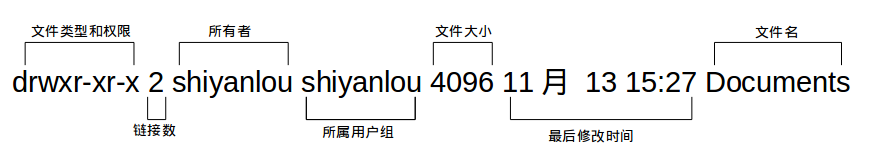
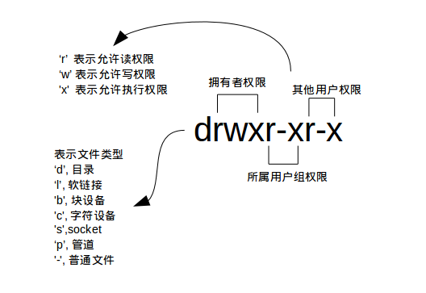
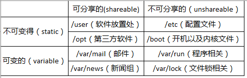
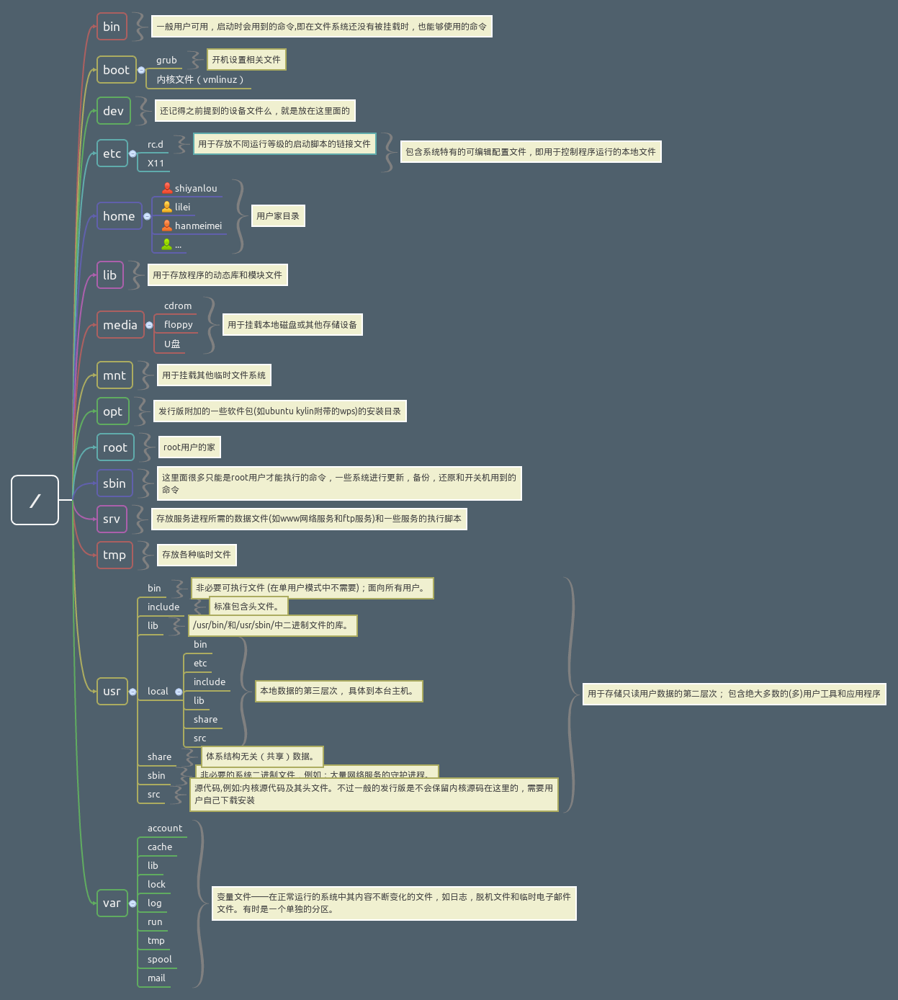

#Linux
### 终端[Terminal]快捷键
`【tab】` 补全参数，补全命令
`【Ctrl+c】`停止当前运行
`【Ctrl+d】`	键盘输入结束或退出终端
`【Ctrl+s】`	暂停当前程序，暂停后按下任意键恢复运行
`【Ctrl+z】`	将当前程序放到后台运行，恢复到前台为命令fg
`【Ctrl+a】`	将光标移至输入行头，相当于Home键
`【Ctrl+e】`	将光标移至输入行末，相当于End键
`【Ctrl+k】`	删除从光标所在位置到行末
`【Alt+Backspace】`	向前删除一个单词
`【Shift+PgUp】`	将终端显示向上滚动
`【Shift+PgDn】`	将终端显示向下滚动

### 终端[Terminal]通配符
`【*】`	匹配 0 或多个字符
`【?】`	匹配任意一个字符
`【[list]】`	匹配 list 中的任意单一字符
`【[!list]】`	匹配 除list 中的任意单一字符以外的字符
`【[c1-c2]】`	匹配 c1-c2 中的任意单一字符 如：[0-9] [a-z]
`【{string1,string2,...}】`	匹配 sring1 或 string2 (或更多)其一字符串
`【{c1..c2}】`	匹配 c1-c2 中全部字符 如{1..10}

### Linux用户以及权限
1. 用户
`【who 参数】` 查看用户 
`-a` 打印能打印的全部 
`-d` 打印死掉的进程 
`-m` 同am i,mom likes
`-q` 打印当前登录用户数及用户名
`-u` 打印当前登录用户登录信息
`-r` 打印运行等级

 `sudo`代表管理员权限
 1. **添加用户** `【sudo adduser xxxx】`
 2. **添加权限** ``
 3. **删除用户** `【sudo adduser xxxx】`

2. 权限
`【ls -l】`查看文件权限


### Linux目录



 

### 基本操作
1. **新建** 
 - `【touch xx】`新建文件
 - `【mkdir xx】`新建目录
2. **复制**
 - `【cp -r 文件或目录 目录】`
3. **删除**
 - `【rm (-f) xx】` 删除文件 加-f表示删除一些只读文件
 - `【rm -r xx】` 删除文件夹
4. **移动文件或重命名**
 - `【mv 文件1 文件2 】` 如果文件2存在则为移动，不存在为重命名
5. **查看文件类型**
 - `【file 文件】`

### 环境变量
1. 变量
>`declare` 用于声明一个变量 `=`赋值 `$`调用 `echo` 控制台显示
>eg. 
```
>declare tmp=hello word
>echo $tmp```

2. 环境变量
 - `set` 显示当前Shell所有环境变量，包括内建变量，用户自定义变量
 - `env` 显示与当前用户相关的环境变量，可以让命令在指定的环境中运行
 - `export` 显示从Shell中导出成环境变量，也能通过其定义变量导出为环境变量
>export|sort>export.txt
set|sort>set.txt
env|sort>env.txt
vimdiff export.txt env.txt set.txt

