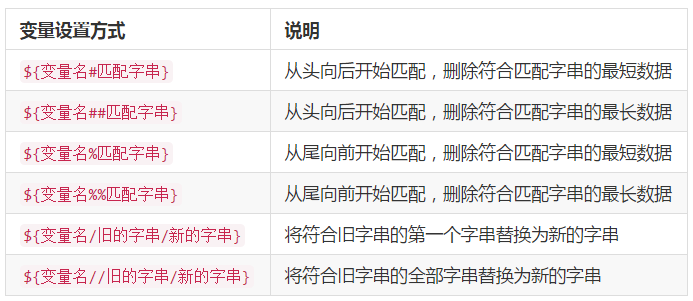

#Linux
### 终端[Terminal]快捷键
`【tab】` 补全参数，补全命令
`【Ctrl+c】`停止当前运行
`【Ctrl+d】`	键盘输入结束或退出终端
`【Ctrl+s】`	暂停当前程序，暂停后按下任意键恢复运行
`【Ctrl+z】`	将当前程序放到后台运行，恢复到前台为命令fg
`【Ctrl+a】`	将光标移至输入行头，相当于Home键
`【Ctrl+e】`	将光标移至输入行末，相当于End键
`【Ctrl+k】`	删除从光标所在位置到行末
`【Alt+Backspace】`	向前删除一个单词
`【Shift+PgUp】`	将终端显示向上滚动
`【Shift+PgDn】`	将终端显示向下滚动

### 终端[Terminal]通配符
`【*】`	匹配 0 或多个字符
`【?】`	匹配任意一个字符
`【[list]】`	匹配 list 中的任意单一字符
`【[!list]】`	匹配 除list 中的任意单一字符以外的字符
`【[c1-c2]】`	匹配 c1-c2 中的任意单一字符 如：[0-9] [a-z]
`【{string1,string2,...}】`	匹配 sring1 或 string2 (或更多)其一字符串
`【{c1..c2}】`	匹配 c1-c2 中全部字符 如{1..10}

### Linux用户以及权限
1. 用户
`【who 参数】` 查看用户 
`-a` 打印能打印的全部 
`-d` 打印死掉的进程 
`-m` 同am i,mom likes
`-q` 打印当前登录用户数及用户名
`-u` 打印当前登录用户登录信息
`-r` 打印运行等级

 `sudo`代表管理员权限
 1. **添加用户** `【sudo adduser xxxx】`
 2. **添加权限** ``
 3. **删除用户** `【sudo adduser xxxx】`

2. 权限
`【ls -l】`查看文件权限


### Linux目录


 

### 基本操作
1. **新建** 
 - `【touch xx】`新建文件
 - `【mkdir xx】`新建目录
2. **复制**
 - `【cp -r 文件或目录 目录】`
3. **删除**
 - `【rm (-f) xx】` 删除文件 加-f表示删除一些只读文件
 - `【rm -r xx】` 删除文件夹
4. **移动文件或重命名**
 - `【mv 文件1 文件2 】` 如果文件2存在则为移动，不存在为重命名
5. **查看文件类型**
 - `【file 文件】`

### 环境变量
1. 变量
>`declare` 用于声明一个变量 `=`赋值 `$`调用 `echo` 控制台显示
>eg. 
```
>declare tmp=hello word
>echo $tmp```

2. 环境变量
 - `set` 显示当前Shell所有环境变量，包括内建变量，用户自定义变量
 - `env` 显示与当前用户相关的环境变量，可以让命令在指定的环境中运行
 - `export` 显示从Shell中导出成环境变量，也能通过其定义变量导出为环境变量
```hash
export|sort>export.txt
set|sort>set.txt
env|sort>env.txt
vimdiff export.txt env.txt set.txt #对比```

3. 添加自定义到环境变量
>将PATH文件执行命令添加到`.bashrc`启动配置文件中
```
echo "PATH=$PATH:/xxx/xxx/bin">>.bashrc
source .bashrc #让环境立即生效（否则应重启）
. ./.bashrc #source的别名. 但使用时加路径```
`>>`表示追加添加，`>`表示覆盖添加

4. 变量修改和删除

>```
>$ path=$PATH
$ echo $path
$ path=${path%/xxx/xxx/bin}
# 或使用通配符,*表示任意多个任意字符
$ path=${path%*/bin}```

### 文件查找
1. `whereis`简单快速
它没有从硬盘中依次查找，而是直接从数据库中查询。`whereis`只能搜索二进制文件(-b)，man帮助文件(-m)和源代码文件(-s)。
2. `locate`快而全
通过"/var/lib/mlocate/mlocate.db"数据库查找，不过这个数据库也不是实时更新的，系统会使用定时任务每天自动执行updatedb命令更新一次，所以有时候你刚添加的文件，它可能会找不到，需要手动执行一次updatedb命令。它可以用来查找指定目录下的不同文件类型，如查找 /etc 下所有以 sh 开头的文件：
>```bash
$ locate /usr/share/\*.jpg #记得\*转义```
3. `which`小而精
通常使用which来确定是否安装了某个指定的软件，因为它只从PATH环境变量指定的路径中去搜索命令
4. `find`精而细
find应该是这几个命令中最强大的了，它不但可以通过文件类型、文件名进行查找而且可以根据文件的属性（如文件的时间戳，文件的权限等）进行搜索。
`【find [path] [option] [action]】`
```
$ find /etc/ -name interfaces```
`-name` 名称搜索
按时间
 - 
`-atime`最后访问时间
`-ctime`创建时间
`-mtime`最后修改时间
 >`-mtime n`n为数字，表示n天之前的“一天内”修改过的
 > `-mtime +n`表示n天前（不包含n）修改过的
 > `-mtime -n`表示n天内（包含n）修改过的
 > `newer [file]`file为一个一存文件，列出比这个还新的文件

###文件打包和压缩
