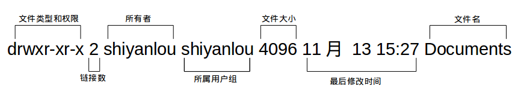
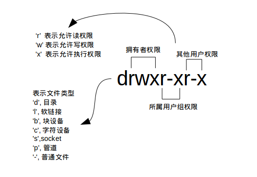
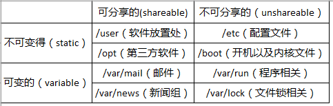
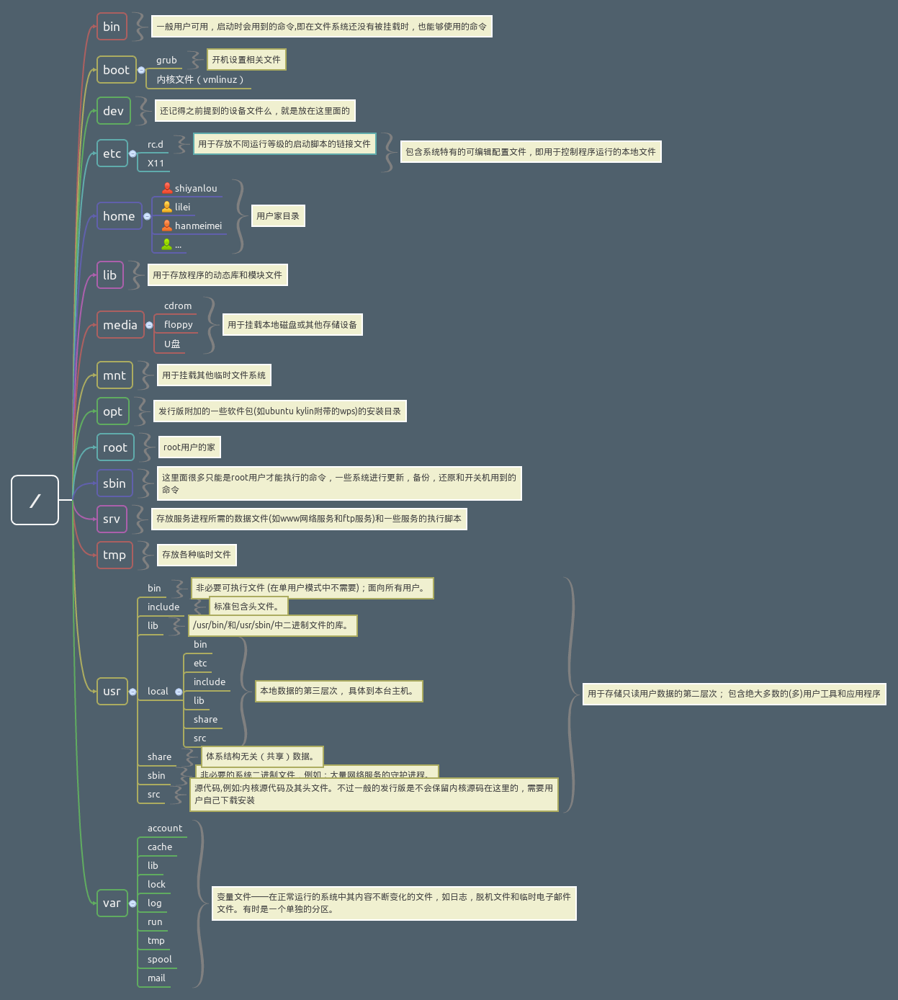

#Linux
### 终端[Terminal]快捷键
`【tab】` 补全参数，补全命令
`【Ctrl+c】`停止当前运行
`【Ctrl+d】`	键盘输入结束或退出终端
`【Ctrl+s】`	暂停当前程序，暂停后按下任意键恢复运行
`【Ctrl+z】`	将当前程序放到后台运行，恢复到前台为命令fg
`【Ctrl+a】`	将光标移至输入行头，相当于Home键
`【Ctrl+e】`	将光标移至输入行末，相当于End键
`【Ctrl+k】`	删除从光标所在位置到行末
`【Alt+Backspace】`	向前删除一个单词
`【Shift+PgUp】`	将终端显示向上滚动
`【Shift+PgDn】`	将终端显示向下滚动

### 终端[Terminal]通配符
`【*】`	匹配 0 或多个字符
`【?】`	匹配任意一个字符
`【[list]】`	匹配 list 中的任意单一字符
`【[!list]】`	匹配 除list 中的任意单一字符以外的字符
`【[c1-c2]】`	匹配 c1-c2 中的任意单一字符 如：[0-9] [a-z]
`【{string1,string2,...}】`	匹配 sring1 或 string2 (或更多)其一字符串
`【{c1..c2}】`	匹配 c1-c2 中全部字符 如{1..10}

### Linux用户以及权限
1. 用户
`【who 参数】` 查看用户 
`-a` 打印能打印的全部 
`-d` 打印死掉的进程 
`-m` 同am i,mom likes
`-q` 打印当前登录用户数及用户名
`-u` 打印当前登录用户登录信息
`-r` 打印运行等级

 `sudo`代表管理员权限
 1. **添加用户** `【sudo adduser xxxx】`
 2. **添加权限** ``
 3. **删除用户** `【sudo adduser xxxx】`

2. 权限
`【ls -l】`查看文件权限


`【chmod】`修改权限
 - 通过不同单位添加减
  > ```
  > chmod u-x file
  > chmod o+w file```
  u表示用户及拥有者
  g表示组
  o表示其他用户
  -表示减少
  +表示添加
 - 通过二进制修改
 >```
 >chmod 777 file
 >chmod 700 file```
 >rwxrwxrwx = 111 111 111 = 777
 >所以 700 = 111 000 000 = rwx------ 

3. 属性 
`【lsattr】`显示文件属性（attribution）
`【chattr】`修改文件属性
 >```
 >lsattr file
 >chattr +i file
 >chattr -a file```
 >i （immutable） 不可改变的，超级用户也不可以
 >a (append only)只能追加内容不能修改删除


### Linux目录



 

### 基本操作
1. **新建** 
 - `【touch xx】`新建文件
 - `【mkdir xx】`新建目录
2. **复制**
 - `【cp -r 文件或目录 目录】`
3. **删除**
 - `【rm (-f) xx】` 删除文件 加-f表示删除一些只读文件
 - `【rm -r xx】` 删除文件夹
4. **移动文件或重命名**
 - `【mv 文件1 文件2 】` 如果文件2存在则为移动，不存在为重命名
5. **查看文件类型**
 - `【file 文件】`

### 环境变量
1. 变量
>`declare` 用于声明一个变量 `=`赋值 `$`调用 `echo` 控制台显示
>eg. 
```
>declare tmp=hello word
>echo $tmp```

2. 环境变量
 - `set` 显示当前Shell所有环境变量，包括内建变量，用户自定义变量
 - `env` 显示与当前用户相关的环境变量，可以让命令在指定的环境中运行
 - `export` 显示从Shell中导出成环境变量，也能通过其定义变量导出为环境变量
```hash
export|sort>export.txt
set|sort>set.txt
env|sort>env.txt
vimdiff export.txt env.txt set.txt #对比```

3. 添加自定义到环境变量
>将PATH文件执行命令添加到`.bashrc`启动配置文件中
```
echo "PATH=$PATH:/xxx/xxx/bin">>.bashrc
source .bashrc #让环境立即生效（否则应重启）
. ./.bashrc #source的别名. 但使用时加路径```
`>>`表示追加添加，`>`表示覆盖添加

4. 变量修改和删除

>```
>$ path=$PATH
$ echo $path
$ path=${path%/xxx/xxx/bin}
# 或使用通配符,*表示任意多个任意字符
$ path=${path%*/bin}```

5. 变量重命名 `alias name='command \!*'`
```shell
alias dir = 'ls-la \!*'
alias #这个可以显示所有的重命名的命令
unalias dir #删除重命名的命令```

### 文件查找
1. `whereis`简单快速
它没有从硬盘中依次查找，而是直接从数据库中查询。`whereis`只能搜索二进制文件(-b)，man帮助文件(-m)和源代码文件(-s)。
2. `locate`快而全
通过"/var/lib/mlocate/mlocate.db"数据库查找，不过这个数据库也不是实时更新的，系统会使用定时任务每天自动执行updatedb命令更新一次，所以有时候你刚添加的文件，它可能会找不到，需要手动执行一次updatedb命令。它可以用来查找指定目录下的不同文件类型，如查找 /etc 下所有以 sh 开头的文件：
>```bash
$ locate /usr/share/\*.jpg #记得\*转义```
3. `which`小而精
通常使用which来确定是否安装了某个指定的软件，因为它只从PATH环境变量指定的路径中去搜索命令
4. `find`精而细
find应该是这几个命令中最强大的了，它不但可以通过文件类型、文件名进行查找而且可以根据文件的属性（如文件的时间戳，文件的权限等）进行搜索。
`【find [path] [option] [action]】`
```
$ find /etc/ -name interfaces```
`-name` 名称搜索
按时间
 - 
`-atime`最后访问时间
`-ctime`创建时间
`-mtime`最后修改时间
 >`-mtime n`n为数字，表示n天之前的“一天内”修改过的
 > `-mtime +n`表示n天前（不包含n）修改过的
 > `-mtime -n`表示n天内（包含n）修改过的
 > `newer [file]`file为一个一存文件，列出比这个还新的文件

###文件打包和压缩
> 安装程序 
> `sudo apt-get install XXX`

#### **zip**
1. **压缩** `zip [options] [filepath]`
 - option参数说明:
  `-r` 递归压缩，用于压缩文件
  `-o` 指定产生的压缩文件名后面接zipname
  `-[0-9]`指定压缩级别
  `-q`安静模式
  `-e`加密压缩包
  `-l` 将LF转为CR+LF
 
 ```shell
echo '##this is a  test!' > test.md
zip -o fuck.zip fuck.md
mkdir test
cp fuck.md test/
zip -r -o -e fuck2.zip fuck.md fuck1.zip test/
Enter password:....
Verify password:.... ```

2. **解压** `unzip [option] [zipfile]`
 - option参数说明:
  `-q` 静默模式.没有屏幕提示
  `-l` 只查看压缩包内容,不解压缩
  `-O` 大写字母O, 指定编码类型
```shell
unzip test.zip
unzip -l test.zip```

#### **rar**
1. `rar`压缩
2. `unrar`解压
 - option参数说明:**没有`-`**
  `a` 添加文件到rar
  `l` 只查看压缩包内容,不解压缩
  `d` 从rar文件中删除文件
 ```shell
 rar a test.rar . ##注意点
 rar a test.rar *.txt
 unrar x test.rar text```
 
####**tar**打包工具
不压缩
```shell
tar -cf test.tar ./home ##创建tar
tar -xf test.tar -c tardir ##解包tar
tar -cfz text.tar.gz ./home ##创建并压缩
tar -xfz test.tar.gz ##解压```
其中压缩时各种格式使用不同参数
`*.tar.gz`格式:	`-z`
`*.tar.xz`格式:	`-J`
`*tar.bz2`格式:	`-j`


###文件系统与磁盘操作
`【pwd】`查看当前目录绝对路径
`【df 】`查看文件系统和磁盘容量 `-h`以易懂方式显示（report file system disk space usage）
`【du】`查看当前目录下所有子文件`-h`以易懂方式，`-d [0-9]`设置查看文件深度（estimate file space usage）

`【dd】`命令
`dd if=/dev/stdin of=test bs=10 count=1`
>if为inFile路径，这里可以省略
>of为outFile输出文件路径
>bs为block size 用于指定块大小缺省为Byte，也可以K,M,G
>count用于指定数量
>当执行命令后在输入，会按指定大小bs指定数量count读取，如果多余会被当作命令
>eg.执行以上命令后输入1234567890ls会列出当前目录下文件
>而test文件中会有1234567890

`dd if=/dev/stdin of=test bs=10 count=1 conv=ucase `
>这条可以转换大小写

####使用dd命令创建虚拟镜像文件
1. 创建新文件`dd`
```shell
#从/dev/zero设备创建一个容量为256M的空文件 
dd if=/dev/zero of=virtual.img bs=1M count=256
#查看文件信息
du -h virtual.img```
2. 创建好的文件格式化`mkfs`
```shell
mkfs.ext4 virtual.img
#会询问是否继续，ext4格式也可以其他格式```

3. 将文件当作磁盘挂载`mount[-o[操作选项]][-t[文件系统类型]][-w|-rw|-ro][文件系统源][挂载点]`
```shell
mkdir virtual 
mount -o loop -t ext4 virtural.img /home/virtual/
mount -o loop -t ext4 virtual.img /mnt 
# 也可以省略挂载类型，很多时候 mount 会自动识别
# 以只读方式挂载
mount -o loop --ro virtual.img /mnt```
4. 卸载已挂载磁盘`umount`
```shell
# 命令格式 sudo umount 已挂载设备名或者挂载点，如：
 sudo umount /mnt```

5. 磁盘分区`fdisk`
`sudo fdisk -l`查看分区情况
`sudo fdisk virtual.img`进入磁盘分区模式
在分区模式中`n`创建新的分区,`p`打印分区信息,`w`写入分好的分区表

6. 挂载虚拟磁盘
 - 使用 `losetup` 命令建立镜像与回环设备的关联
```
sudo losetup /dev/loop0 virtual.img
# 如果提示设备忙你也可以使用其它的回环设备，"ls /dev/loop*"参看所有回环设备
# 解除设备关联
sudo losetup -d /dev/loop0```
 - 为各分区建立虚拟设备的映射，用到`kpartx工具`，需要先安装：
```
sudo apt-get install kpartx
#建立映射
sudo kpart kpartx -av /dev/loop0
# 取消映射
sudo kpart kpartx -dv /dev/loop0```
 - 使用mkfs格式化各分区
```shell
sudo mkfs.ext4 -q /dev/mapper/loop0p1
sudo mkfs.ext4 -q /dev/mapper/loop0p5
sudo mkfs.ext4 -q /dev/mapper/loop0p6```

 - 在/media目录下新建四个空目录用于挂载虚拟磁盘：
```shell
$ mkdir -p /media/virtualdisk_{1..3}
# 挂载磁盘分区
$ sudo mount /dev/mapper/loop0p1 /media/virtualdisk_1
$ sudo mount /dev/mapper/loop0p5 /media/virtualdisk_2
$ sudo mount /dev/mapper/loop0p6 /media/virtualdisk_3
# 卸载磁盘分区
$ sudo umount /dev/mapper/loop0p1
$ sudo umount /dev/mapper/loop0p5
$ sudo umount /dev/mapper/loop0p6```

### Linux任务计划crontab
目的：定期的执行一些任务
>`crontab -e`启动crontab 第一次会选择编辑工具
>`*`表示任何；`,`表示并，都2，5；`-`表示到3-10；`/n`每隔0-59/5每隔5分钟
```shell
*/1 * * * * touch /home/$(date +\%Y\%m\%d\%H\%M\%S)
#格式是：分 时 日 月 周 命令
#这里表示每隔1分钟创建一个文件以时间为名```
>注意 “ % ” 在 crontab 文件中，有结束命令行、换行、重定向的作用，前面加 ” \ ” 符号转意，否则，“ % ” 符号将执行其结束命令行或者换行的作用，并且其后的内容会被做为标准输入发送给前面的命令。


### 命令执行顺序
1. 使用`;`来进行命令的分割
2. 使用`|`来将输出变成下一个的输入
3. `||`和`&&`来进行选择等操作

###简单文本处理命令
1. `【tr】`tr 命令可以用来删除一段文本信息中的某些文字。或者将其进行转换。
` -d`	删除和set1匹配的字符，注意不是全词匹配也不是按字符顺序匹配
`-s	`去除set1指定的在输入文本中连续并重复的字符
```
# 删除 "hello shiyanlou" 中所有的'o','l','h'
$ echo 'hello shiyanlou' | tr -d 'olh'
# 将"hello" 中的ll,去重为一个l
$ echo 'hello' | tr -s 'l'
# 将输入文本，全部转换为大写或小写输出
$ cat /etc/passwd | tr '[:lower:]' '[:upper:]'
# 上面的'[:lower:]' '[:upper:]'你也可以简单的写作'[a-z]' '[A-Z]',当然反过来将大写变小写也是可以的```
2. `【col】`col 命令可以将Tab换成对等数量的空格建，或反转这个操作。
`-x`	将Tab转换为空格
`-h`	将空格转换为Tab（默认选项）
```
# 查看 /etc/protocols 中的不可见字符，可以看到很多 ^I ，这其实就是 Tab 转义成可见字符的符号
$ cat -A /etc/protocols
# 使用 col -x 将 /etc/protocols 中的 Tab 转换为空格,然后再使用 cat 查看，你发现 ^I 不见了
$ cat /etc/protocols | col -x | cat -A```
3. `【join】`这个命令就是用于将两个文件中包含相同内容的那一行合并在一起
`-t`	指定分隔符，默认为空格
`-i`	忽略大小写的差异
`-1`	指明第一个文件要用哪个字段来对比，，默认对比第一个字段
`-2`	指明第二个文件要用哪个字段来对比，，默认对比第一个字段
```
# 创建两个文件
$ echo '1 hello' > file1
$ echo '1 shiyanlou' > file2
$ join file1 file2
# 将/etc/passwd与/etc/shadow两个文件合并，指定以':'作为分隔符
$ sudo join -t':' /etc/passwd /etc/shadow
# 将/etc/passwd与/etc/group两个文件合并，指定以':'作为分隔符, 分别比对第4和第3个字段
$ sudo join -t':' -1 4 /etc/passwd -2 3 /etc/group```

4. `【paste】`paste这个命令与join 命令类似，它是在不对比数据的情况下，简单地将多个文件合并一起，以Tab隔开。
`-d`	指定合并的分隔符，默认为Tab
`-s`	不合并到一行，每个文件为一行
```
$ echo hello > file1
$ echo shiyanlou > file2
$ echo www.shiyanlou.com > file3
$ paste -d ':' file1 file2 file3
$ paste -s file1 file2 file3```

### Linux 安装软件
1. 在线安装
`sudo apt-get install XXX`
2. 磁盘安装
不同的系统可能用的是不一样的软件管理工具，需要查看
`sudo dpkg -i xxxx.deb`
3. 二进制软件安装
二进制包的安装比较简单，我们需要做的只是将从网络上下载的二进制包解压后放到合适的目录，然后将包含可执行的主程序文件的目录添加进PATH环境变量即可
4. 源代码编译安装
源代码可以通过编译器变成二进制文件后再安装

